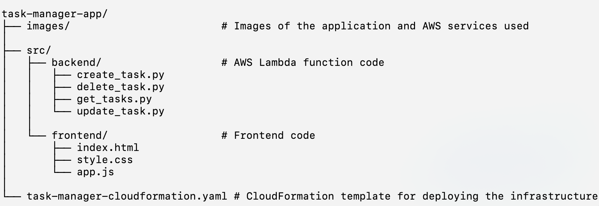

# Task Manager Application

A simple task management application deployed on AWS, utilizing services such as AWS Lambda, DynamoDB, API Gateway, and AWS Amplify. This application allows users to create, read, update, and delete tasks. The front-end is hosted on AWS Amplify, and the backend operations are managed by AWS Lambda functions exposed through API Gateway.

## Table of Contents

- [Architecture](#architecture)
- [Project Structure](#project-structure)
- [Application Flow](#application-flow)
- [Getting Started](#getting-started)
  - [Prerequisites](#prerequisites)
  - [Deployment](#deployment)
- [Screenshots & Overview](#screenshots-and-overview)

## Architecture

The application is built on the following AWS services:

- **DynamoDB**: Stores the task data.
- **AWS Lambda**: Executes the backend logic for task management (CRUD operations).
- **API Gateway**: Serves as the interface for the Lambda functions, enabling HTTP requests.
- **AWS Amplify**: Hosts the front-end of the application.

## Project Structure

The project is organized as follows:

## Application Flow

1. **User Interacts with the UI**: The user interacts with the front-end hosted on AWS Amplify, performing actions such as adding, editing, or deleting tasks.

2. **API Gateway**: The front-end sends HTTP requests to the API Gateway, which is configured with REST endpoints for each CRUD operation.

3. **Lambda Functions**: The API Gateway triggers the appropriate Lambda function (`create_task`, `get_tasks`, `update_task`, `delete_task`) based on the request.

4. **DynamoDB**: The Lambda functions interact with DynamoDB to perform the necessary operations, storing or retrieving task data.

5. **Response**: The results from DynamoDB are sent back through the API Gateway to the front-end, where the user can see the updated task list.

## Getting Started

### Prerequisites

- **AWS Account**: You need an AWS account to deploy this application.
- **Create an S3 Bucket**: 
    - Create an S3 bucket where you will upload the Lambda function code.
	- Zip each of the Python files (create_task.py, get_tasks.py, update_task.py, delete_task.py) into individual .zip files.
	- Upload the .zip files to the S3 bucket.
- **GitHub Repository**: Create a GitHub repository to store your frontend code. You’ll need to provide this repository’s URL when deploying the Amplify app.
- **GitHub Personal Access Token**: Generate a GitHub Personal Access Token to allow AWS Amplify to access your repository.

### Deployment

1. **Configure the CloudFormation Template**: Update the task-manager-cloudformation.yaml file with your S3 bucket name, GitHub repository URL, and GitHub token.

2. **Deploy with AWS CloudFormation**: Use the AWS CLI or AWS Management Console to deploy the CloudFormation stack. The stack will create the necessary resources.

3. **Update the Frontend Configuration**:
	- Once the stack is deployed, go to the CloudFormation stack outputs and copy the API URL provided.
	- Open the app.js file located in the src/frontend/ directory.
	- Replace the value of the apiUrl variable with the API URL from the CloudFormation outputs. Example: const apiUrl = 'https://<your-api-url>/dev/tasks';

4. **Push Changes to the Remote Repository**: After updating the apiUrl in app.js, commit and push the changes to your remote repository.

5. **Deploy the Frontend with AWS Amplify**: Go to the AWS Amplify console. Select the app connected to your repository and deploy the branch containing the updated app.js file.
	
6. **Access the Application**: Once the frontend is deployed, navigate to the Amplify app URL to access the application.

### Screenshots & Overview

Create a task

Application Overview

Edit a task

Confirmation message when deleting a task

